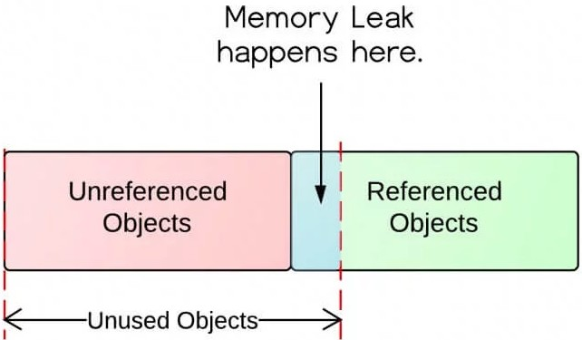

# Java Application Memory Leaks

Empowering you to perform Heap dump generation & Analysis using JMAP, JMAT, JVisualVM Tools. :100:

## As part of this you will learn. 

:zap: How to generate Heap dump using various tools inorder to detect, the memory leaks that occur as part of your application.
- Check the below link on how to install and use the tool.

:link: [Heap Dump Generation Tools](https://www.linkedin.com/pulse/heap-dump-generation-analysis-using-jmap-jmat-tools-vanchireddy/)

:zap: How Inefficeint coding can lead to Memory Leak 
- Check below link for detailed explaination.

:link: [Analysis of Memory Leak](https://www.linkedin.com/pulse/analysis-memory-leak-java-applications-via-heapdump-vanchireddy/)

:no_entry_sign: Various reasons for this to occur :shipit:
- Objects are continuously instantiated without being released.
- Unclosed Connections (DataBase Leak)
- Static Field holding on to the Object Reference
- Adding Objects with no hashCode() and equals() into a HashMap
- Verbose
